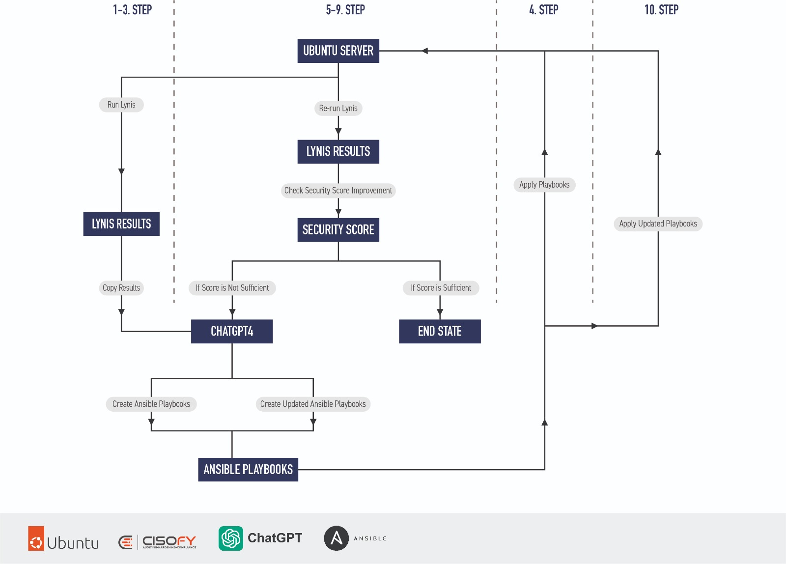
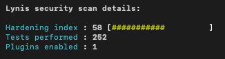
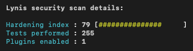

In an era of escalating cyber threats, enhancing server security is vital. This article showcases an innovative approach for hardening your Ubuntu server, using the combined powers of Lynis, ChatGPT-4, and Ansible.

Through a step-by-step process, you'll learn how to perform a Lynis security audit, utilise ChatGPT-4 to translate the audit findings into Ansible playbooks, apply these playbooks to enhance security, and validate the hardening by re-running Lynis. You'll also witness the tangible improvement in the server's security posture by comparing the pre and post-hardening Lynis scores.

Join me as I delve into this unique fusion of AI, robust security auditing, and efficient configuration management to elevate your server's security.

The Ansible playbook can be found in the repository.

# The concept 


 


**Steps to harden a Ubuntu workstation with Lynis, ChatGPT 4 and Ansible**

1. Run Lynis on the Ubuntu Server.
2. Copy the Lynis results into ChatGPT4.
3. ChatGPT4 creates Ansible playbooks based on the Lynis results.
4. Apply the created Ansible playbooks to the Ubuntu Server.
5. Re-run Lynis on the Ubuntu Server.
6. Check the security score improvement.
7. If the score is sufficient, the process reaches an end state.
8. If the score is not sufficient, copy the new Lynis results into ChatGPT4.
9. ChatGPT4 creates updated Ansible playbooks based on the new Lynis results.
10. Apply the updated Ansible playbooks to the Ubuntu Server.

# Results

Standard Ubuntu workstation |  After applying the Ansible playbook
:-------------------------:|:-------------------------:
   |  

We can see that we increased the hardening index by more then 20 points. One thing to note is that Lynis also run more assessments which makes it difficult to compare both runs. 

# Use of Ansible examples

**How to run an Ansible playbook**
`ansible-playbook -i hosts lynis_hardeningV2.yml -u MYUSER --ask-become-pass --ask-pass -vv`


**How to run an Ansible playbook with a SSH key**
`ansible-playbook -i hosts lynis_hardeningV2.yml -u MYUSER --key-file "~/.ssh/ssh-XXX-may23" --ask-become-pass`

**Ansible 'hosts' file**

```
[MYUSER]
10.11.11.197 ansible_port=2222
```

# How to run a Lynis audit
`sudo lynis audit system`